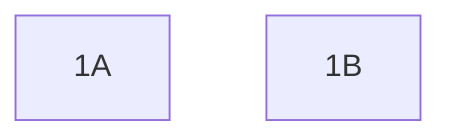

# README

## Backend Challenges

## Setup

```bash
yarn docker-build
yarn docker-run
```

## Instructions

This is a TypeScript React project. Complete the following challenges. There is no particular order for the following challenges



## Challenges

1. Pagination

    1A. JSON Pagination
      - The endpoint `/listings` returns a JSON that is not paginated.
      - Modify the endpoint so that it accepts the parameters:
        - `page`: default 1
        - `pageSize`: default 5
        and returns the data in the format:
        - `{ page: 1, pageSize: 5, data: [...] }`

    1B. JSON Sorting
      - The endpoint `/listings` returns a JSON that is sorted just by id.
      - Modify the endpoint so that it accepts the parameters:
        - `sortBy`: one of `title`, `id`. default `id`
        - `sortDirection`: either `asc` or `desc`. default `asc`
        and returns the data in the format:
        - `{ page: 1, pageSize: 5, data: [...] }`
